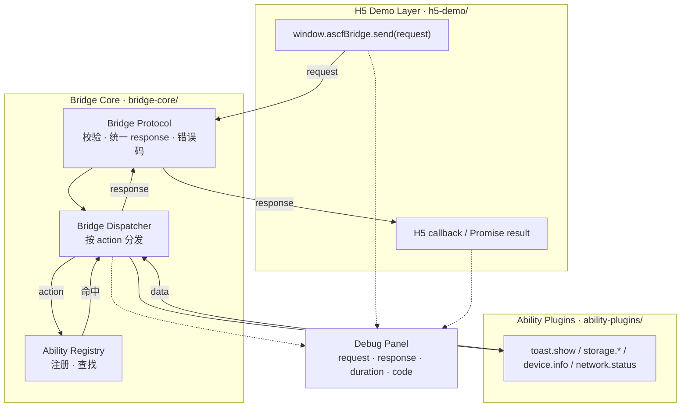

# ASCF Mini Runtime Lab

> ⚠️ 学习用开源实验项目，**非任何公司官方实现**，不含任何闭源 / 内网 / 真实业务信息。

ASCF Mini Runtime Lab 是一个用于学习小程序容器、WebView JSBridge、H5 调 Native 能力、能力注册分发、离线包加载与调试链路的实验项目。

它不是 ASCF 官方实现，而是一个公开、安全、最小化的学习模型，用来帮助理解 Hybrid Runtime 的核心架构。

> 📌 **当前进度：Stage 0 / Task 1（文档骨架）**
> 本仓库目前只包含项目文档与路线规划。H5 Demo、Bridge Core、Ability 插件、Debug Panel 等代码尚未实现，将按 [开发路线](#开发路线) 逐步补齐。下文中标记「规划中」的内容代表目标形态，而非当前已落地功能。

---

## 为什么做这个项目

普通 H5 页面跑在浏览器沙箱里，**无法直接调用系统能力**（toast、存储、设备信息、剪贴板……）。
小程序 / Hybrid App 的做法是：把 H5 放进一个 **WebView 容器**，再通过 **JSBridge** 把「H5 世界」和「Native 世界」连起来。

本项目用最小代价把这条链路讲清楚，目标是能回答下面这些问题：

1. 为什么 H5 不能直接调用 Native 能力？
2. JSBridge 在 WebView 容器里起什么作用？
3. `requestId` 为什么重要？
4. `action` 为什么要走注册表？
5. Dispatcher 和 Ability 为什么要分开？
6. `UNKNOWN_ACTION` 是怎么产生的？
7. `PARAM_ERROR` 应该在哪一层处理？
8. Native 如何主动回调 H5？
9. 离线包解决了什么问题？
10. 调试面板为什么对框架维护重要？

> 第一个问题的展开见 [docs/01-why-jsbridge.md](docs/01-why-jsbridge.md)。

---

## 核心架构图

请求向下流经各层，响应原路返回，Debug Panel 旁路观测整条链路。
源文件见 [docs/diagrams/runtime-architecture.mmd](docs/diagrams/runtime-architecture.mmd)。



分层职责详见 [SKILL.md](skill.md) 第 5 节。

---

## 核心能力（规划中）

| 能力 | 说明 | 状态 |
| --- | --- | --- |
| 统一 JSBridge 协议 | request / response / 错误码统一结构 | ⏳ 规划中 |
| 能力注册分发 | Registry 注册 + Dispatcher 按 `action` 分发 | ⏳ 规划中 |
| Mock Native 能力 | `toast.show`、`storage.*`、`device.info`、`network.status` | ⏳ 规划中 |
| 错误场景复现 | `UNKNOWN_ACTION` / `PARAM_ERROR` / `TIMEOUT` | ⏳ 规划中 |
| 调试面板 | 展示 request / response / duration / code | ⏳ 规划中 |
| 离线包加载实验 | 本地包加载 + 版本号 + fallback 错误页 | ⏳ 规划中 |
| ArkTS WebView 容器 | HarmonyOS Web 组件 + `javaScriptProxy` 接入 | ⏳ 规划中 |

---

## 目录结构

> 以下为目标结构（摘自 [SKILL.md](skill.md) 第 4 节）。✅ 表示当前已存在，其余为规划中。

```txt
ascf-mini-runtime-lab/
├── README.md                       ✅ 项目门面
├── skill.md                        ✅ 开发约束 / AI 协作规范
├── docs/
│   ├── 00-project-roadmap.md       ✅ 阶段路线
│   ├── 01-why-jsbridge.md          ✅ 为什么需要 JSBridge
│   ├── 02-bridge-protocol.md       ⏳ 协议设计
│   ├── 03-ability-registry.md      ⏳ 能力注册表
│   ├── 04-dispatch-flow.md         ⏳ 分发流程
│   ├── 05-error-handling.md        ⏳ 错误处理
│   ├── 06-offline-package.md       ⏳ 离线包
│   └── diagrams/
│       ├── runtime-architecture.mmd ✅ 分层架构图
│       └── bridge-sequence.mmd      ⏳ 调用时序图
├── h5-demo/                        ⏳ H5 演示页（index.html / bridge.js / style.css）
├── bridge-core/                    ⏳ 协议 / 注册表 / 分发器 / 错误码
├── ability-plugins/                ⏳ toast / storage / device / network
├── debug-panel/                    ⏳ 调试面板
├── harmony-container/              ⏳ ArkTS WebView 容器
└── examples/                       ⏳ basic-call / unknown-action / param-error
```

---

## 快速开始

> ⏳ 规划中。H5 Demo 落地后（Stage 1 / Task 2），将支持「浏览器直接打开 `h5-demo/index.html`」即可体验调用链路，无需构建步骤。届时本节会补全实际命令。

当前阶段可阅读的内容：

- 项目定位与约束：[skill.md](skill.md)
- 阶段路线：[docs/00-project-roadmap.md](docs/00-project-roadmap.md)
- 为什么需要 JSBridge：[docs/01-why-jsbridge.md](docs/01-why-jsbridge.md)

---

## 调用链路示例（目标形态）

H5 发起请求（必须带 `id` 与 `action`）：

```js
window.ascfBridge.send({
  id: "req_001",
  version: "1.0.0",
  action: "toast.show",
  params: { message: "Hello ASCF Mini Runtime" }
})
```

Native 成功响应：

```json
{
  "id": "req_001",
  "action": "toast.show",
  "code": 0,
  "msg": "success",
  "data": { "shown": true }
}
```

未知 action 的错误响应：

```json
{
  "id": "req_002",
  "action": "unknown.action",
  "code": 404,
  "msg": "UNKNOWN_ACTION",
  "data": null
}
```

---

## 错误码说明

所有能力共用同一套错误码与响应结构，禁止各 ability 自定义格式。

| code | msg | 含义 | 典型产生层 |
| --- | --- | --- | --- |
| `0` | `SUCCESS` | 调用成功 | Ability |
| `400` | `PARAM_ERROR` | 参数缺失 / 非法 | Protocol / Ability |
| `404` | `UNKNOWN_ACTION` | action 未注册 | Registry / Dispatcher |
| `408` | `TIMEOUT` | 调用超时 | Dispatcher |
| `500` | `INTERNAL_ERROR` | 能力内部异常 | Ability |

---

## 调试面板

> ⏳ 截图占位。Debug Panel（Stage 4 / Task 4）落地后，将在此补充展示 request / response / duration / code 的实际截图或 GIF。

```txt
[ 调试面板截图占位 — 实现后替换为真实图片 ]
```

---

## 开发路线

完整阶段计划见 [docs/00-project-roadmap.md](docs/00-project-roadmap.md)。概览：

| 阶段 | 主题 | 状态 |
| --- | --- | --- |
| Stage 0 | 项目初始化 / 文档骨架 | 🔄 进行中 |
| Stage 1 | H5 Mock 跑通 | ⏳ |
| Stage 2 | Bridge Core（协议 / 注册表 / 分发器） | ⏳ |
| Stage 3 | Ability Plugins | ⏳ |
| Stage 4 | Debug Panel | ⏳ |
| Stage 5 | ArkTS WebView 容器 | ⏳ |
| Stage 6 | 离线包 Demo | ⏳ |
| Stage 7 | 文档与简历化 | ⏳ |

---

## 学习笔记

- [docs/00-project-roadmap.md](docs/00-project-roadmap.md) — 阶段路线与验收标准
- [docs/01-why-jsbridge.md](docs/01-why-jsbridge.md) — 为什么 H5 需要 JSBridge 才能调 Native
- 后续将补充：协议设计、能力注册、分发流程、错误处理、离线包等专题

---

## 免责声明

- 本项目为**个人公开学习实验项目**，与任何公司、任何官方 ASCF 实现无关。
- 所有命名（`ascfBridge`、`MiniRuntime`、`MockToastAbility` 等）均为公开学习用 mock 名称，不对应任何真实闭源协议或业务 action。
- 不包含任何内网地址、token、cookie、真实用户数据或闭源代码。
- 仅用于理解 WebView 容器、JSBridge 与小程序运行时架构。
