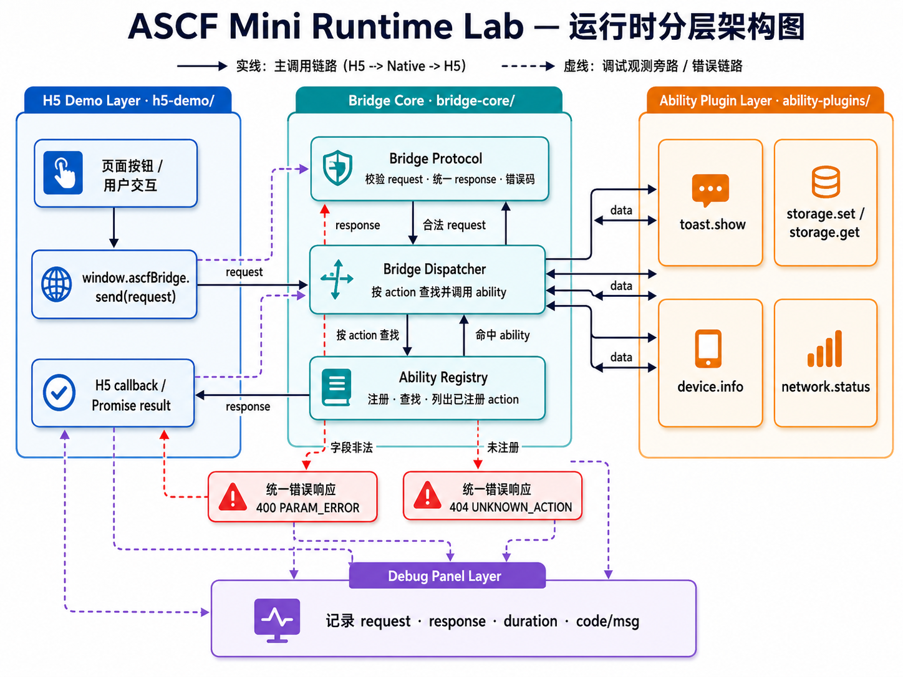

# ASCF Mini Runtime Lab

> ⚠️ 公开学习实验项目，**不是 ASCF 官方实现**，不包含任何公司内部闭源代码。

## 项目介绍

ASCF Mini Runtime Lab 是一个用于学习**小程序容器、WebView JSBridge、H5 调 Native 能力、能力注册分发、协议封装、错误处理与调试链路**的公开学习项目。

它不是 ASCF 官方实现，而是一个公开、安全、最小化的学习模型，用来帮助理解 Hybrid Runtime（小程序容器 / WebView 混合运行时）的核心架构。

## 为什么做这个项目

普通 H5 页面跑在浏览器沙箱里，**没有通道直接调用系统能力**（toast、存储、设备信息……）。小程序 / Hybrid App 的通用做法是：把 H5 放进 WebView 容器，再用 JSBridge 把「H5 世界」和「Native 世界」连起来。

这个项目想用最小代价把这件事讲清楚——不是堆功能，而是能回答这些问题：

- 为什么 H5 不能直接调用 Native？
- JSBridge 在容器里到底起什么作用？
- `requestId` / `action` / 注册表 / 分发器各自解决什么问题？
- `UNKNOWN_ACTION`、`PARAM_ERROR`、`TIMEOUT` 这些错误从哪一层产生？
- 调试链路为什么对框架维护很重要？

> 展开见 [docs/01-why-jsbridge.md](docs/01-why-jsbridge.md)。

## 核心调用链路

整个项目围绕这一条链路展开：

```txt
H5 页面点击按钮
  → window.ascfBridge.send(request)
  → Bridge Protocol（校验请求结构 / 统一协议）
  → Bridge Dispatcher（按 action 分发）
  → Ability Registry（查找已注册能力）
  → Mock Native Ability（执行能力）
  → Response Protocol（统一响应 / 错误码）
  → H5 callback / Promise result
  → Debug Log（全链路记录）
```

最小示例（目标形态）：

```js
window.ascfBridge.send({
  id: "req_001",
  version: "1.0.0",
  action: "toast.show",
  params: { message: "Hello ASCF Mini Runtime" }
})
// → { id: "req_001", action: "toast.show", code: 0, msg: "success", data: { shown: true } }
```

## 架构图



> 图片由 [docs/diagrams/runtime-architecture.mmd](docs/diagrams/runtime-architecture.mmd) 渲染导出。
> 修改架构时请改 `.mmd` 源文件并重新导出 PNG，保持图文一致。

## 当前阶段目标

当前已完成 **Stage 1 / Stage 2 / Stage 3 / Stage 4 / Stage 5.1（Runtime Engine 骨架）/ Stage 5.2（Ability Monitor）**，Stage 5 整体进行中（待补 PerformanceMonitor / Timeline 等扩展）。

- **Stage 1**：H5 + JavaScript Mock 跑通调用链路（`window.ascfBridge.send` → mock response）。
- **Stage 2**：抽出 Bridge Core 分层（protocol / errors / registry / dispatcher）。
- **Stage 3**：扩展 Ability Plugins，6 个能力：`toast.show` / `device.info` / `storage.set` / `storage.get` / `network.status` / `clipboard.write`。
- **Stage 4**：把 Debug Log 抽成独立旁路观测层 `debug-panel/debugPanel.js`（统计、Registered Actions、复制）。
- **Stage 5.1**：新增 `runtime/` 层（Runtime / RuntimeState / EventBus），把"装配 + 调度 + 观测 + 状态 + 事件"收拢到 Runtime；`bridge.js` 回归 H5 Demo 组装层。
- **Stage 5.2（最新）**：新增 `runtime/AbilityMonitor.js`，作为 EventBus 订阅者按 action 维度累计统计（total / success / failure / 平均·最大耗时 / 最近 code·msg），与 DebugPanel 互补：DebugPanel 看单次账单，AbilityMonitor 看能力报表。

整套 demo 仍保持**浏览器直接打开 `h5-demo/index.html` 即可运行**（或通过 Live Server / 本地 http）。控制台可用：
```js
MiniRuntimeDevtools.getState()                                // Runtime 状态快照
MiniRuntimeDevtools.getLogs()                                 // DebugPanel 当前日志
MiniRuntimeDevtools.runtime.getAbilityMonitor().getStats()    // AbilityMonitor 统计数组
```

## 目录结构

```txt
ascf-mini-runtime-lab/
├── README.md                          项目门面
├── skill.md                           开发约束 / AI 协作规范
├── docs/                              学习文档（00 路线图 + 01~06 专题 + 架构图）
│   ├── 00-project-roadmap.md
│   ├── 01-why-jsbridge.md
│   ├── 02-bridge-protocol.md
│   ├── 03-ability-registry.md
│   ├── 04-dispatch-flow.md
│   ├── 05-ability-plugins.md
│   ├── 06-debug-panel.md
│   ├── assets/runtime-architecture.png
│   └── diagrams/runtime-architecture.mmd
├── h5-demo/                           H5 演示页（浏览器可直接打开）
│   ├── index.html
│   ├── bridge.js                      组装层：装配 registry + send + 绑定 UI
│   └── style.css
├── bridge-core/                       可复用桥接核心
│   ├── protocol/bridgeProtocol.js     校验 / 统一 request·response
│   ├── errors/bridgeErrors.js         统一错误码
│   ├── registry/abilityRegistry.js    action -> ability 注册表
│   └── dispatcher/bridgeDispatcher.js 校验 → 查找 → 调用 → 包装
├── ability-plugins/                   Mock Native 能力
│   ├── toast/toastAbility.js          toast.show
│   ├── device/deviceAbility.js        device.info
│   ├── storage/storageAbility.js      storage.set + storage.get
│   ├── network/networkAbility.js      network.status
│   └── clipboard/clipboardAbility.js  clipboard.write
├── debug-panel/                       旁路观测层
│   └── debugPanel.js                  日志 / 统计 / 已注册 action / 复制
├── runtime/                           Mini Runtime 统一入口
│   ├── Runtime.js                     装配 Registry/Dispatcher/DebugPanel/State/EventBus/Monitor
│   ├── RuntimeState.js                运行时状态 + snapshot
│   ├── EventBus.js                    runtime / request / ability 事件总线
│   └── AbilityMonitor.js              按 action 维度累计统计（EventBus 订阅者）
└── examples/                          （规划中）basic-call / unknown-action / param-error
```

## 开发路线

| 阶段 | 主题 | 状态 |
| --- | --- | --- |
| Stage 0 | 项目初始化（文档 + 目录骨架） | ✅ |
| Stage 1 | H5 Mock 跑通 | ✅ |
| Stage 2 | Bridge Core（协议 / 注册表 / 分发器） | ✅ |
| Stage 3 | Ability Plugins | ✅ |
| Stage 4 | Debug Panel | ✅ |
| Stage 5 | Runtime Engine（统一入口 / State / EventBus / AbilityMonitor） | 🚧 进行中 |
| Stage 6 | ArkTS WebView Container | ⏳ |
| Stage 7 | Offline Package / 文档简历化 | ⏳ |

详见 [docs/00-project-roadmap.md](docs/00-project-roadmap.md)。

## 免责声明

- 本项目**不是 ASCF 官方实现，不包含任何公司内部闭源代码**。
- 不包含任何公司内部真实名称、真实 action、真实日志、内网地址、token 或真实用户数据。
- 所有命名（`ascfBridge`、`MiniRuntime`、`MockToastAbility` 等）均为公开学习用 mock 名称。
- 仅用于理解 WebView 容器、JSBridge 与小程序运行时架构。
